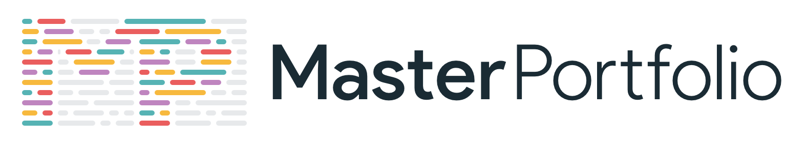

 
    </img>

<h1 align="center"> Jonas Lundholm Portfolio 🔥 </h1> 

  
  
  
  
   
  
  
  

If you want to discuss about something, you can ask on my <a href="https://discord.com/invite/GkcbM5bwZr">Discord Server</a>.

 
    <a href="https://jolundholm.github.io" target="_blank">
    </img>
  </a>

